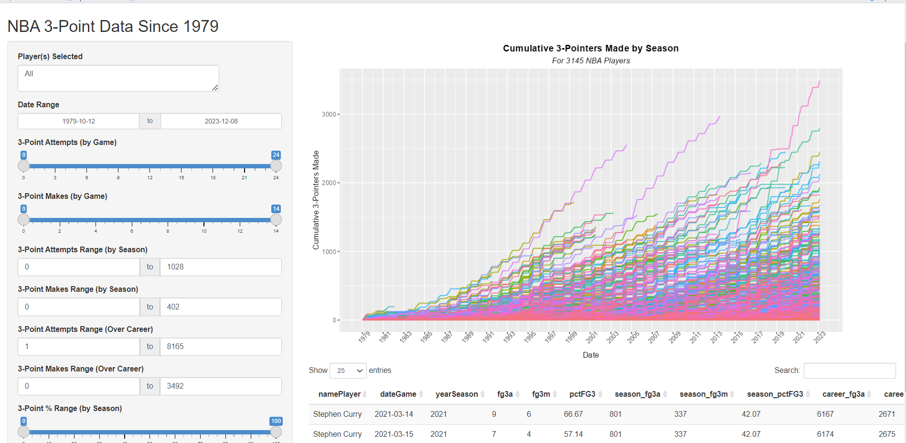

# NBA Threes Since 1979

## Purpose

This Shiny app is designed to give NBA 'stat fanatics' a medium to interact with player 
3-point data in ways typically unavailable on major NBA statistics platforms. Users can uncover hidden insights on over 3000 NBA players since the birth of the 3-point line.

## Preview



## Setup

### Prerequisites
Make sure you have both [R and RStudio](https://posit.co/download/rstudio-desktop/) downloaded before running any code.

### Usage
From there, depending on your local machine specs, you may need to run the command 
```R
Sys.setenv("VROOM_CONNECTION_SIZE" = 500000)
```
to ensure the [data set](data/nba.csv) used in this app can load and display in your environment.

The following packages must be installed on your computer for the [app.R](app.R) and [R/functions.R](R/functions.R) files to run:
- `tidyverse`
- `dplyr`
- `ggplot2`
- `ggthemes`
- `shiny`
- `shinyWidgets`
- `shinyFeedback`

To install these packages, you can simply run:
```R
install.package("package name here")
```

All analogous library calls are included in the [R/functions.R](R/functions.R) file.

## References 

Data Set Source:

- [abresler / nbastatR](https://github.com/abresler/nbastatR)

App Inspiration:

- [NYT: Stephen Curry's 3-Point Record in Context: Off the Charts](https://www.nytimes.com/interactive/2016/04/16/upshot/stephen-curry-golden-state-warriors-3-pointers.html)

